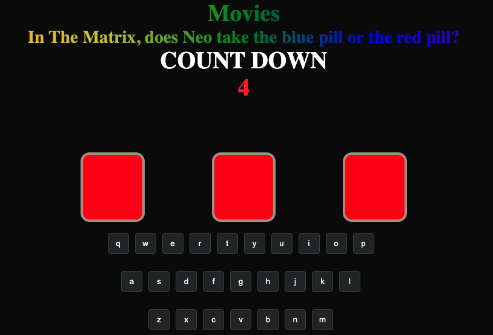

# Spaceman
## Intro to game 
A Spaceman's incommodity:

    You're an unlucky spaceman out in the far reaches of space locked out of his space station. 

    In order to get back inside, you have to correctly guess the entry password.

    But don't take too long remember there's a countdown!

    A random category is selected for you, guess the word to gain entry and pray you get it right the first time! or get EJECTED!

#Game Previews, the start and end state of the game.

## Give it a TRY:

     https://foobar-undefined.github.io/Spaceman/

## Rules:
- It's a one player game
- The player selects a category  and guesses the word
- Player chooses one character at a time to guess the puzzle
- After each character is selected,  if the character is found in the puzzle it will be displayed
- if a character is selected it cannot be reused
- if the player cannot guess the word when the countdown reaches 0, the player loses
- the 'try again' button  will reset the game and losing will also reset the game. 

### PsuedoCode
Page will load and the game will start automatically
When the game starts game state will be initialized
The game will have an alphabet board, a puzzle a countdown display and an ice box. 
The game starts with a randmonly selected categotry.

Alphabet board will be rendered:
- Puzzle will be displayed for the length of character needed to solve
- alphabet buttons clicked on cannot be reclicked
- Turns left to guess are displayed (Countdown)

Alphabet board will be displayed any of the 26 character can be selected.
Player cannot reselect category unless they restart.
- if a character is clicked
    The puzzle will check if the character is within the array 
    - if not Countdown decreases 
    - else found
        - Puzzle will display letter on page 
    - Character can no longer be selected 

A win condition will be evaluated did the player win or lose
A win message will display if the current player wins or lose
the player wins if they guess the puzzle before the count-down ends
if countdown finishes before the player guesses the puzzle, spaceman gets ejected.

## Technologies
HTML, JavaScrpt, CSS
